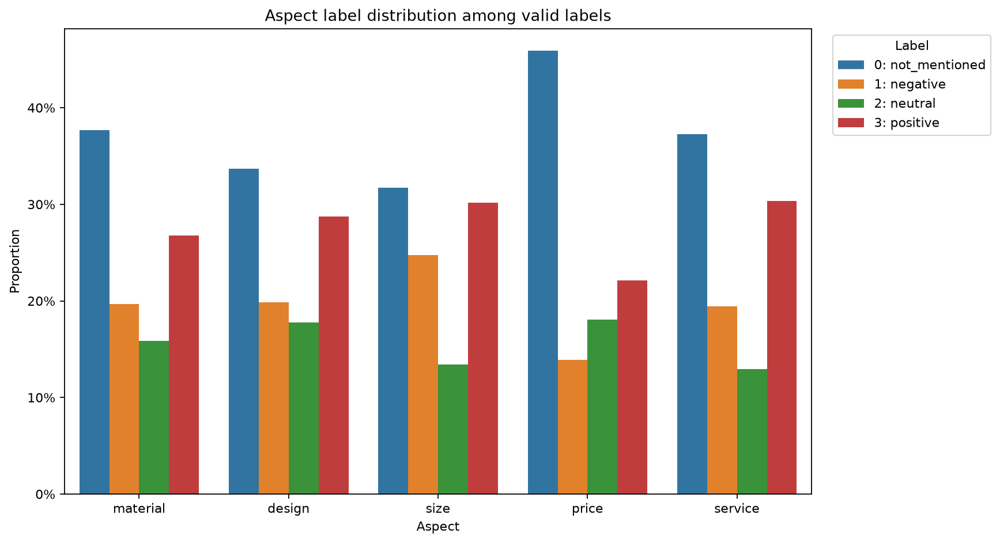
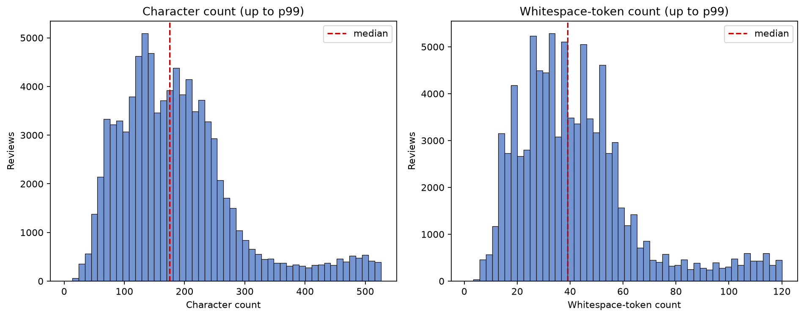
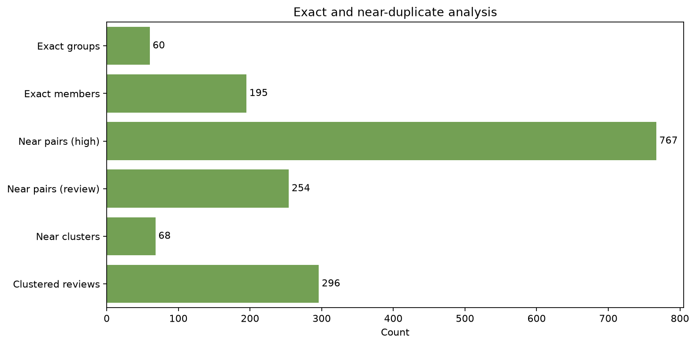

# Phase 1 Dataset Exploration Report

## Dataset

- Dataset: `vinhplaykennen/FashionReviews`
- Pinned revision: `60abb1cef934cb248b88a2ce4c99bb1ea3129c92`
- Split: `train`
- Rows: 89,145
- Fingerprint: `069278ac005d656e`
- Source records modified: no

## Schema and Labels

| Column | Type | Definition |
|---|---|---|
| STT | `int64` | Source review identifier. |
| Nội dung review | `str` | Vietnamese fashion-review text. |
| Chất liệu | `float64` | Material aspect label: 0=not mentioned, 1=negative, 2=neutral, 3=positive. |
| Kiểu dáng | `float64` | Design aspect label: 0=not mentioned, 1=negative, 2=neutral, 3=positive. |
| Kích cỡ | `float64` | Size aspect label: 0=not mentioned, 1=negative, 2=neutral, 3=positive. |
| Giá cả | `float64` | Price aspect label: 0=not mentioned, 1=negative, 2=neutral, 3=positive. |
| Dịch vụ | `float64` | Service aspect label: 0=not mentioned, 1=negative, 2=neutral, 3=positive. |

Labels are fixed as `0=not mentioned`, `1=negative`, `2=neutral`, and `3=positive`.

## Data Quality

- Null or empty reviews: 0 null, 0 empty.
- Invalid labels outside 0-3: 0.
- Missing label cells: 70.
- Missing `Chất liệu` labels: 6.
- Missing `Kiểu dáng` labels: 18.
- Missing `Kích cỡ` labels: 12.
- Missing `Giá cả` labels: 13.
- Missing `Dịch vụ` labels: 21.

## Label Distribution

| Aspect | Mentioned | Missing | Dominant class | Largest/smallest ratio |
|---|---:|---:|---|---:|
| material | 62.30% | 6 | 0: not_mentioned | 2.38 |
| design | 66.33% | 18 | 0: not_mentioned | 1.90 |
| size | 68.28% | 12 | 0: not_mentioned | 2.37 |
| price | 54.10% | 13 | 0: not_mentioned | 3.30 |
| service | 62.70% | 21 | 0: not_mentioned | 2.88 |

## Review Text

- Characters: median 175, p95 441, p99 526, maximum 706.
- Whitespace tokens: median 39, p95 100, p99 120, maximum 161.
- IQR upper outliers: 5,523 by characters and 5,936 by tokens.
- Multiline reviews: 1,249; repeated punctuation: 3,180; digit-containing reviews: 17,249.
- URL heuristic: 0; emoji-like heuristic: 0; product-code-like heuristic: 1,472.

Length outliers are retained. The observed p95/p99 values should inform later vectorizer and tokenizer limits.

## Duplicate and Augmentation Findings

- Exact normalized groups: 60 groups containing 195 reviews.
- Exact groups with label conflicts: 24.
- Verified near-duplicate pairs: 1,021, including 767 high-confidence and 254 needs-review pairs.
- High-confidence near clusters: 68, containing 296 reviews.
- Near clusters with label conflicts: 21.
- The source data does not provide an original-review group ID.

## Representative Review Samples

The notebook and `eda_summary.json` contain one deterministic median-length sample for every available aspect/label pair. They also contain five multi-aspect reviews with mixed sentiment labels. Only IDs and short previews are stored.

| Aspect | Label | Review ID | Characters | Preview |
|---|---|---:|---:|---|
| material | 0: not_mentioned | 29 | 133 | Giao hàng nhanh, mình đã mua nhiều lần tại shop rồi. Đặt hôm qua mà nay có liền, hàng đẹp mà giá thành lại hợp lý. Ủng hộ shop 5 sao. |
| material | 1: negative | 1180 | 186 | Áo len chất liệu hơi xù lông sau vài lần mặc. Kiểu dáng áo khoác bình thường. Kích cỡ áo khoác vừa vặn. Giá cả sản phẩm này khá cao so với chất lượng. Dịch vụ giao hàng của shop... |
| material | 2: neutral | 1430 | 228 | Vải quần kaki này hơi cứng, không được mềm mại như mong đợi. Kiểu dáng quần ống đứng này khá cơ bản. Kích cỡ lại rộng hơn bình thường. Giá thành sản phẩm ở mức trung bình. Shop... |
| material | 3: positive | 878 | 193 | Áo có chất liệu vải tốt, sờ vào mềm mịn. Thiết kế cổ áo không được ưng ý cho lắm. Kích cỡ thì đúng như mô tả, không cần phải chỉnh sửa gì. Giá cả hơi nhỉnh một chút, nhưng shop... |
| design | 0: not_mentioned | 169 | 132 | Mình mua size M mà mặc bị rộng vai với dài tay quá. Giá tiền thì khá là cao. Phải khen shipper giao hàng rất nhanh và chuyên nghiệp. |
| design | 1: negative | 250 | 189 | Đi công viên nước mà một phen hú vía vì đồ bơi không có lớp lót, khi ướt là lộ hết phần nhạy cảm của con gái mình. May mà mình mua mẫu cũ có hình Sonic che chắn bớt, chứ không t... |
| design | 2: neutral | 617 | 206 | Chất vải áo sơ mi hơi nhăn, cần là ủi kỹ trước khi mặc. Kiểu dáng áo không có điểm nhấn đặc biệt. Kích cỡ áo vừa vặn thoải mái. Giá cả sản phẩm ở tầm trung, dịch vụ giao hàng nh... |
| design | 3: positive | 246 | 196 | Vải cotton gauze mềm nhất nhưng không hề mỏng manh. Dáng rộng rãi nhưng tay áo và cổ áo làm nó tôn dáng. Màu xanh tuyệt đẹp khi nhìn trực tiếp. Yêu chiếc váy này đến nỗi sẽ quay... |
| size | 0: not_mentioned | 812 | 120 | Giao hàng nhanh, đóng gói cẩn thận. Quần mới mở ra siêu thơm, chất vải dày dặn. Sản phẩm rất đẹp, mọi người nên mua nhé. |
| size | 1: negative | 182 | 184 | Chất liệu vải này khá ổn, không quá mềm cũng không quá thô. Kích cỡ hơi rộng so với mô tả. Kiểu dáng đơn giản, mặc hàng ngày được. Giá cả ở mức chấp nhận được, shop giao hàng đú... |
| size | 2: neutral | 1454 | 220 | Chất liệu vải được, không quá xuất sắc nhưng cũng không tệ. Kiểu dáng cơ bản, không có gì nổi bật nhưng dễ mặc. Mình mặc size S thấy vừa vặn, không cần sửa. Săn được đợt sale nê... |
| size | 3: positive | 558 | 190 | Chất liệu áo thun không quá dày cũng không quá mỏng, mặc mùa hè được. Kiểu dáng đơn giản, không có điểm nhấn. Kích cỡ thì vừa vặn thoải mái. Giá tiền lại hơi cao. Shop giao hàng... |
| price | 0: not_mentioned | 1898 | 152 | Chất lượng không tốt lắm. Tôi mua từ tháng 5/2018 mà đến tháng 7/2018 một chiếc nơ đã bị rơi ra. Ngoài vấn đề đó thì con gái tôi rất thích đôi giày này. |
| price | 1: negative | 881 | 193 | Chất liệu tệ kinh khủng, trông không giống hình chút nào. Vải này làm mình nhớ đến quần áo búp bê Barbie, thậm chí mình chắc là Barbie cũng thấy xấu hổ khi mặc nó. Mỏng dính và... |
| price | 2: neutral | 429 | 187 | Vải bị xù lông chỉ sau vài lần giặt. Kiểu dáng áo khá đơn điệu, không có điểm nhấn. Kích cỡ lại rất vừa vặn với mình. Giá cả cũng hợp lý. Dịch vụ chăm sóc khách hàng của shop bì... |
| price | 3: positive | 404 | 174 | Mình mua lúc giảm giá. Màu xanh trên họa tiết chim rất đẹp và mình thích chi tiết ở tay áo. Hơi mỏng một chút, nhưng ổn nếu mặc với áo lót màu nude hoặc áo hai dây bên trong. |
| service | 0: not_mentioned | 404 | 174 | Mình mua lúc giảm giá. Màu xanh trên họa tiết chim rất đẹp và mình thích chi tiết ở tay áo. Hơi mỏng một chút, nhưng ổn nếu mặc với áo lót màu nude hoặc áo hai dây bên trong. |
| service | 1: negative | 414 | 189 | Áo này chất vải không co giãn nhiều. Kiểu dáng khá đơn điệu, không có điểm nhấn. Kích cỡ áo hơi ôm sát. Giá thì phải chăng, phù hợp với sinh viên. Dịch vụ tư vấn của shop hơi ch... |
| service | 2: neutral | 2822 | 219 | Kiểu dáng áo khá phổ biến, dễ phối đồ. Áo mình mặc hơi rộng phần vai một chút nhưng vẫn chấp nhận được. Tuy nhiên, mức giá cho chiếc áo này thực sự quá mắc so với giá trị. Shop... |
| service | 3: positive | 215 | 149 | Quần đặt size L tưởng rộng ai dè mặc vừa in. Giá hơi chát so với mặt bằng chung. Nhưng shop giao hàng hỏa tốc và tư vấn cực kỳ nhiệt tình, đáng tiền. |

## Recommended Phase 2 Policy

1. Keep the source dataset immutable. Write all normalized data to interim or processed artifacts.
- Normalize Unicode to NFKC and collapse whitespace in the processed text while retaining the untouched source text.
- Preserve Vietnamese diacritics, negation, punctuation, digits, emoji, and product-code-like tokens unless later experiments demonstrate that a signal is harmful.
- Do not remove length outliers automatically; inspect them and use model truncation based on measured percentiles.
- Missing labels: Never replace missing labels with label 0. For independent aspect models, exclude a row only from the affected aspect; for a future multi-head model, use a masked loss or an explicitly documented complete-case policy.
- Grouping: Build a stable group key from the union of exact-duplicate groups and connected high-confidence near-duplicate clusters. Assign unmatched reviews individual stable group IDs, then perform a deterministic grouped split with multilabel distribution checks. Never allow a group to cross train, validation, or test boundaries.
- Label conflicts: Keep conflicting duplicate members in one split, retain all original labels, and require manual adjudication before any deduplication or label overwrite.
- Exact duplicates and high-confidence near-duplicate clusters must be merged into the same grouping graph before splitting.
- `needs_review` pairs are not grouped automatically.

This strategy is leakage-resistant because all known variants of the same review are assigned atomically to one split.

## Limitations

- Near-duplicate LSH is a scalable heuristic and does not guarantee recall of every semantic paraphrase.
- Product-code detection is a conservative uppercase letter-and-digit heuristic, not a domain lexicon.
- The source dataset provides one train split and no original-review group identifier.
